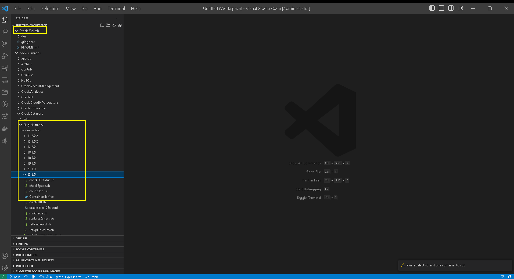

# DevOracle23cLAB

1. After Creating the GitHub Repository and the GitBook Project with the same name and connect them together , clone the new repository to PROJECTS local folder on your Laptop.
2. Connect VSCode to this new Project and and clone the Oracle docker-images project to the VSCode workspace , after clone the docker-image to the same local PROJECTS folder:

<figure><figcaption>
VSCode for Oracle23cLAB
</figcaption></figure>

* Now follow the Instruction founded on the GitHub <mark style="color:orange;">**Oracle/docker-images**</mark> webpage for Oracle23c dockerfile ..
